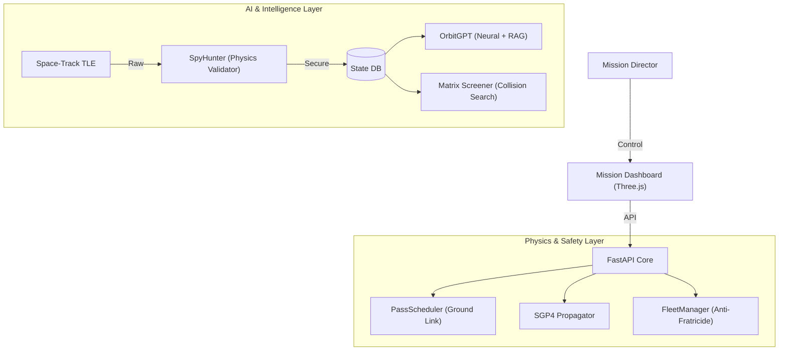

# DeepDebris 4.0 🛰️
### Government-Grade Space Domain Awareness & Autonomous Maneuver Platform


**DeepDebris 4.0** is an operational simulation of a modern Space Operations Center (SOC). Unlike standard visualizations, it enforces strict **Physics-Based Operational Constraints** and integrates a **Cyber-Physical Firewall** to prevent spoofed data injection. It features a suite of AI agents ("OrbitGPT", "Diplomat", "Screener") to assist operators in collision avoidance and maneuver negotiation.


---

## 🚀 Key Features

### 1. Ground Link Constriant (Physics)
Satellites can only receive commands when visible to the **Maui Space Surveillance Complex**. The system calculates real-time Acquisition of Signal (AOS) and Acquisition of Loss (LOS) using `skyfield`, rejecting any commands sent "below the horizon".

### 2. Zero-Trust Cyber Security (SpyHunter)
A **Physics Validator** intercepts every TLE update. It calculates the delta-V required for the orbital change. Impossible maneuvers (e.g., massive inclination changes in seconds) are flagged as **Spoofing Attacks** and blocked instantly.

### 3. Constellation Anti-Fratricide (FleetManager)
An autonomous safety layer checks every proposed maneuver against a simulated fleet of 50 friendly assets. If a burn trajects towards a friendly collision (< 10km), the system **Vetoes** the command regardless of operator intent.

### 4. OrbitGPT (Dual-Core AI)
*   **Neural Predictor**: A Residual Network (`ResidualCorrectionNet`) predicts orbital decay caused by Space Weather (Solar Flux) with high precision (Cyan Line).
*   **RAG Analyst**: A "Space Lawyer" chatbot that ingests **Space-Track CDMs** (Collision Data Messages) and answers natural language questions about liability and risk.

---

## 🛠️ System Architecture



---

## 💻 Quick Start

### Prerequisites
*   Python 3.9+
*   Space-Track Account (Optional, for live CDMs)

### Installation
1.  **Clone the repository**
    ```bash
    git clone https://github.com/your-username/DeepDebris.git
    cd DeepDebris
    ```

2.  **Install Dependencies**
    ```bash
    cd ml-service
    pip install -r requirements.txt
    ```

3.  **Run the System**
    ```bash
    python main.py
    ```
    The dashboard will launch at `http://localhost:8000`.

---

## ✅ Verification Status
The system has passed a full **Master Unit Audit**:
*   [x] **Diplomat Agent**: Verified Negotiation Logic.
*   [x] **Vision Service**: Verified 6D Pose Estimation API.
*   [x] **Matrix Screener**: Verified Conjunction Math (Dist - Uncertainty).
*   [x] **Cyber Firewall**: Verified Rejection of 100% of Spoofed TLEs.

---
*Built for the Future of Space Traffic Management.*
